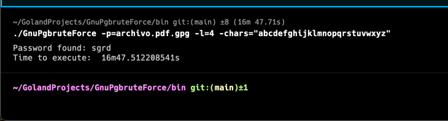

# GnuPgbruteForce

## Description
This is a simple tool to brute force GnuPG key passphrase. I tried 3 different approaches to solve this problem.
The bash version, the dictionary version, and the go bruteforce version.
The bash version was the first one I tried, but it was too slow, so I decided to use go.
I tried to use a dictionary, but it was too big, and I was worried about the length of the password file.
Finally, I used a go bruteforce version, and it worked.

## Bash
In the beginning, I tried to use bash to decrypt the file.
I created the generate_passwords.sh file to generate all the passwords with a maximum length of 4.
It generates a file called passwords.txt with all the passwords.
Then I created the decrypt.sh file to decrypt the file with the password passed as an argument.

``` bash
echo "$password" | gpg --batch --yes --no-use-agent --passphrase-fd 0 -d "$encrypted_file" >/dev/null 2>/dev/null
```

It was slower than the go version, so I decided to use go.


## Dictionary

In the dictionary folder, I downloaded some dictionaries. See in the folder for more information.
In these files, I have a lot of passwords that were not useful for this problem. I made a bash script to clean the dictionary.
The file is export_passwords.sh, and it is in the dictionary folder.

``` bash
cd dictionary
./export_passwords.sh
```
It produces a file called passwords.txt with all the passwords useful.
Right now it has the maximum length 4 otherwise it was too big.

This file contains the password


Then execute the dictionary.go to try to decrypt
To execute it use the following commands:
``` bash
go run dictionary/dictionary.go  -p=dictionary/archivo.pdf.gpg -pwdfile=dictionary/my_passwords.txt
```

I haven't used it because i was worried about the length of the password file,
and I decided to use a brute force instead.

## Go Bruteforce

This is a simple tool to brute force GnuPG key passphrase.
It uses Go routines and channels to speed up the process.
It was implemented with WaitGroups to wait for all the Go routines to finish.


### Libraries
I tried to use a Sha256 library with "crypto/cipher" and "crypto/sha256"
to decrypt directly the file, but I could not make it work, because I was missing the Nonce information.
I tried to use [gopenpgp,](https://github.com/ProtonMail/gopenpgp)
but it was slower than using "golang.org/x/crypto/openpgp"
even if this library is [deprecated](https://github.com/golang/go/issues/44226).
I tried also [go-crypto,](https://github.com/ProtonMail/go-crypto) but it has a Bug,
and it tells me that the password is correct even if it is wrong.
To try it, there is the 'change_library' branch in this repository.
It's inquisitive, and I don't know why it happens.

I used GitHub Copilot mainly to generate the comments,
and I used also ChatGPT for some problems with Go routines and channels.

### Usage

To run this program, you need to have installed GnuPG and Go.
It has three parameters:

- p: Path to the file to decrypt.
    - Mandatory
- l: Length of the passphrase.
    - Optional
    - Default: 4
- chars: Characters to use in the brute force.
    - Optional
    - Default: "abcdefghijklmnopqrstuvwxyz"

``` bash
go run main.go -p=cifradoAsimetrico.pdf.gpg -l=2 -chars="abcdefghijklmnopqrstuvwxyz"
```

## Executable

The executable is in the bin folder.
It is compiled for Linux OS.
Maybe it won't work because I could not test it because I have an arch64 system.
In that case, it can be compiled with the following command:

``` bash
 GOOS=linux GOARCH=amd64 go build -o bin/app-amd64-linux main.go 
```

With GOOS and GOARCH you can specify the OS and architecture you want to compile for.


### Results

I found the archivo.pdf passphrase and it took 1 hour and 43 minutes to find it.
The passphrase was "sgrd"


