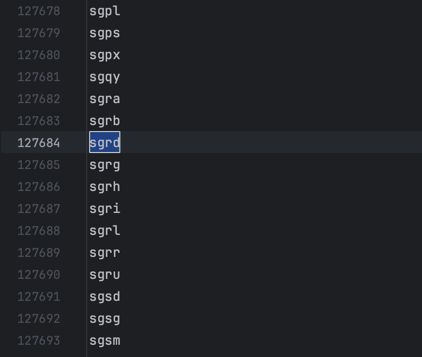

# GnuPgbruteForce

## Description

This is a simple tool to brute force GnuPG key passphrase.
It uses Go routines and channels to speed up the process.
It was implemented with WaitGroups to wait for all the Go routines to finish.
I used GitHub Copilot mainly to generate the comments,
and I used also ChatGPT for some problems with Go routines and channels.

I tried to use [gopenpgp](https://github.com/ProtonMail/gopenpgp) but it was slower than using "golang.org/x/crypto/openpgp" even if this library is [deprecated](https://github.com/golang/go/issues/44226).

## First Idea

My first idea was to use a dictionary attack, but I could not find a dictionary with the words I needed.
I tried to use [SecLists](


## Results
I found the archivo.pdf passphrase and it took 1 hour and 43 minutes to find it.
The passphrase was "sgrd"



## Usage

To run this program you need to have installed GnuPG and Go.
It has 3 parameters: 
- p: Path to the file to decrypt. 
  - Mandatory
- l: Length of the passphrase. 
  - Optional
  - Default: 4
- chars: Characters to use in the brute force. 
  - Optional
  - Default: "abcdefghijklmnopqrstuvwxyz"

``` bash
go run main.go -p=cifradoAsimetrico.pdf.gpg -l=2 -chars="abcdefghijklmnopqrstuvwxyz"
```

## Executable

The executable is in the bin folder.
It is compiled for Linux OS.
Maybe it won't work because I could not test it because I have an arch64 system.
In that case, it can be compiled with the following command:

``` bash
 GOOS=linux GOARCH=amd64 go build -o bin/app-amd64-linux main.go 
```
With GOOS and GOARCH you can specify the OS and architecture you want to compile for.
